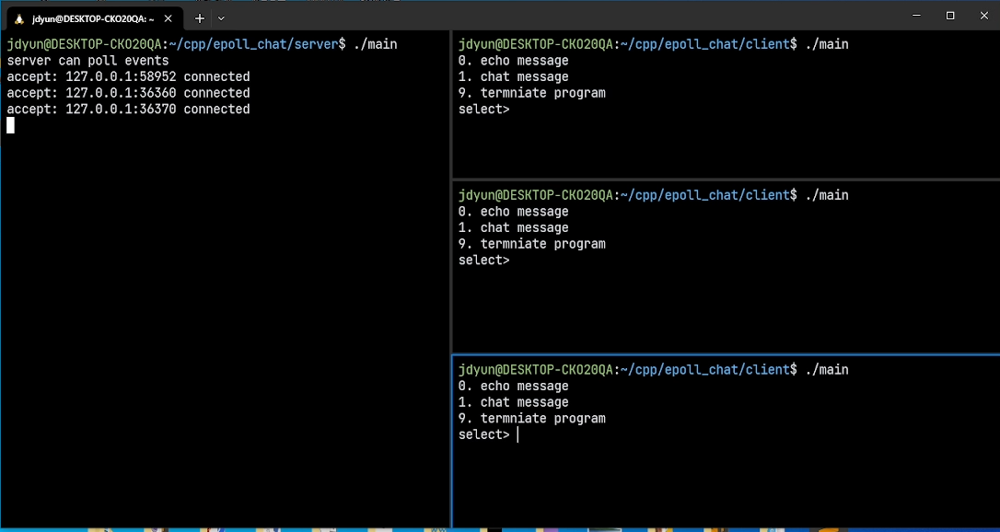

### 소개 
Epoll에 대해서 학습 후 만들어본 채팅서버 프로그램입니다.  
윈도우10환경에서 WSL 터미널에 접속 후 neovim이라는 코드 에디터를 활용해서 작성하였습니다.

### 실행 이미지


### 실행 방법
```
cd server       // 서버 폴더로 이동
make            // 빌드
./main          // main 실행파일 실행
```


### 리눅스 C++ 개발환경 구성법
[내가 작성한 글](https://blog.naver.com/reversing_joa/223269307659)
